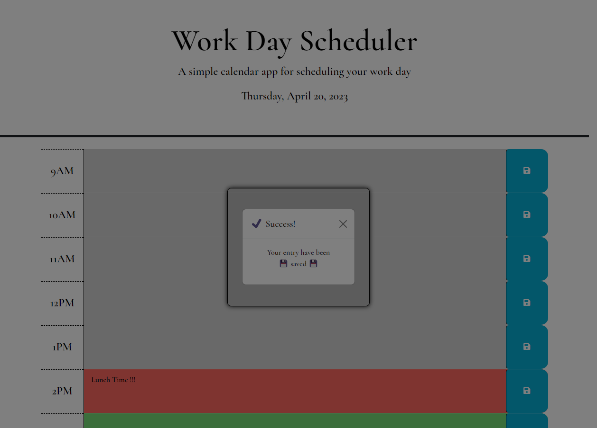

# work-day-scheduler

## Description

This week, I was tasked in creating a daily planner application that is based on the standard business hours. The application allows the user to save events within each of those hours. The application will run in the browser with uses of jQuery, Daysjs, and Bootstrap.

## User Story

```md
AS AN employee with a busy schedule
I WANT to add important events to a daily planner
SO THAT I can manage my time effectively
```

## Acceptance Criteria

```md
GIVEN I am using a daily planner to create a schedule
WHEN I open the planner
THEN the current day is displayed at the top of the calendar
WHEN I scroll down
THEN I am presented with timeblocks for standard business hours
WHEN I view the timeblocks for that day
THEN each timeblock is color coded to indicate whether it is in the past, present, or future
WHEN I click into a timeblock
THEN I can enter an event
WHEN I click the save button for that timeblock
THEN the text for that event is saved in local storage
WHEN I refresh the page
THEN the saved events persist
```
## Installation

N/A

## Feature / Usage



* The application will display the time blocks from 9 AM - 5 PM.
* The gray blocks indicates the time are in the past.
* The red block indicates it is the current hour.
* The green blocks indicates the hours are future hours.
* The blue save button on the side save the description for that specific time block.

### Credits

N/A

#### Website Link
[Click here for live site](https://slmov215.github.io/)

#### Contact
[Stephen Mov on GitHub](https://github.com/slmov215/work-day-scheduler)
## License

Please refer to the LICENSE in the repo.
